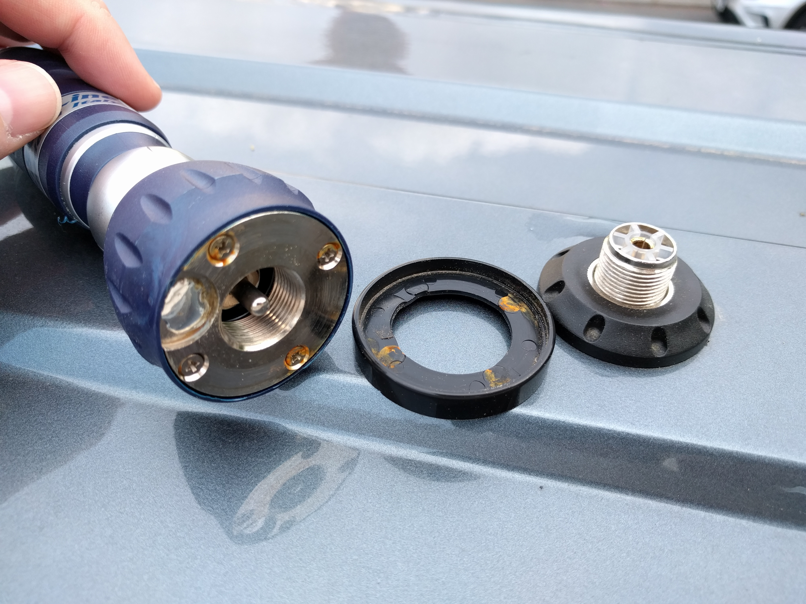

# Radio setup

Note that this is about CB and ham radio, not the public broadcast thing.

## Antenna mounts

There are two SO-239 antenna mounts (Sirio HPAC-U) on the top of the roof, left and right of the rear skylight. 
The position is a trade-off between reception quality and all the other things that need to go on the roof, especially the solar panels. 
Also, the antennas needed to be easily accessible for maintenance, which isn't that easy on a vehicle that's 2.8m high. 
If you're interested, there's also the (German) [forum post where I'd been asking for suggestions](https://www.funkbasis.de/viewtopic.php?f=47&t=45253).

I wouldn't recommend the mounts too much, since the top of the base is a bit concave, which seems to reduce the waterproofing effectiveness of the seals on antennas. 
In fact I'm currently struggling with getting this thing really waterproof.

The mounts have been bought and installed by a contractor of the company that built my van. 
I would highly recommend leaving the installation to a professional. 
They should provide at least a year or two of warranty against running into trouble with rust.

## CB antenna

I'm using a Sirio Turbo 800 antenna for CB radio, bought at [Neuner](https://www.pmr-funkgeraete.de/).  
It does the job. 
The screws in its base are not stainless, but on the other hand this told me very vividly that the rubber seal isn't working too well.

## CB radio

I'm using a President Grant II Premium station (also from Neuner; they manually calibrate each unit before sending them to you), mainly because of the sheer amount of features. 
I have yet to do extensive testing, but it made a good first impression. 
The auto squelch is a nice quality of life improvement, although it's sometimes not sensitive enough.

The Albrecht AE 5890 is a good alternative, and I don't quite remember why I've decided against it, but it must have been just a minor thing.

## Amateur radio

I haven't really started working on my ham license yet, so there's currently no ham station set up in the vehicle.
