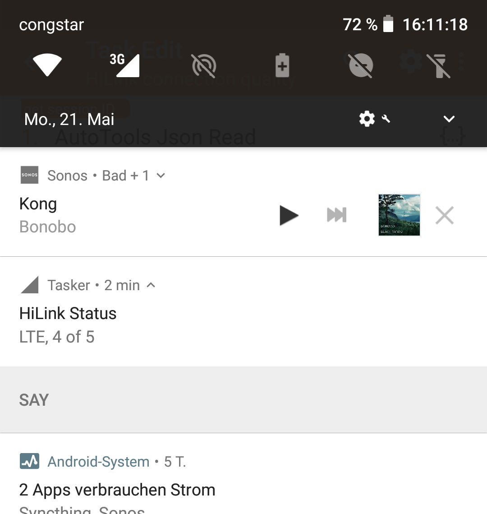

# Tasker HiLink connection status

This is a set of [Tasker](https://tasker.joaoapps.com/) definitions that allow me to keep an eye on the connection quality of my LTE uplink while driving. 
It's not quite finished yet, but already somewhat usable.

## What it does

It's querying the API of a Huawei HiLink device (like a E3372 LTE surfstick or a Vodafone Gigacube) on `192.168.8.1` to find out what kind of mobile connection there is available at the moment (LTE, GPRS, none at all) and how good the reception is. 
This information is shown in a permanent notification. 
The notification's icon also changes based on the type and quality of network available.

Additionally, whenever the type of connection changes, it will be announced by speech.

## Why I need it

I live and work in a van. 
In order to choose a parking spot for my daily work, it's important to know _before_ parking, how good my reception is going to be.

Since the internet connection in my van is provided by an LTE stick connected to a Raspberry Pi, it's hard to visually check it while driving. 
Also, my mobile phone isn't necessarily using the same cellular network as the uplink stick, which is why it's useless to trust my phone's reception.

## What the tasks do

* `HiLink connect`: to be called after connecting to the WiFi network that uses the HiLink uplink. Will enable the regular polling interval and run an initial status check.
* `HiLink disconnect`: to be called after disconnecting from the WiFi ("exit task"). Clears variables and the notification.
* `HiLink connection quality`: Does the actual checking. Will fire `HiLink say` if needed and create/update the notification.
* `HiLink poll`: Runs `HiLink connection quality` if `%HILINK_POLL` (set by `HiLink connect` and cleared by `HiLink disconnect`) is set. To be called at regular intervals (e.g. 2 minutes).
* `HiLink say`: Will announce the current connection quality via text-to-speech.

## To-dos

* Currently, the only connection mode it knows is "LTE". All others will be announced as "unknown mode: n", where n is the number that's returned by the HiLink API. There are [mappings available online](https://github.com/trick77/huawei-hilink-status/blob/882085681f752c0d70918f50e782f0d7f839ffb0/hstatus.py#L86-L142), but I didn't copy-paste them yet, because I want to see which ones are really in use.
* Since it doesn't know anything but LTE, its icon can only have 4 or 3 bars (or an error symbol).
* In the future, I want to replace it by a server-side tool, but right now, this'll have to do.
